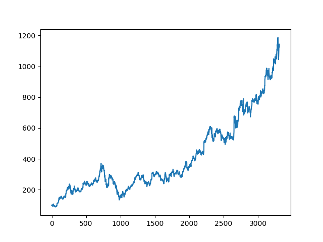
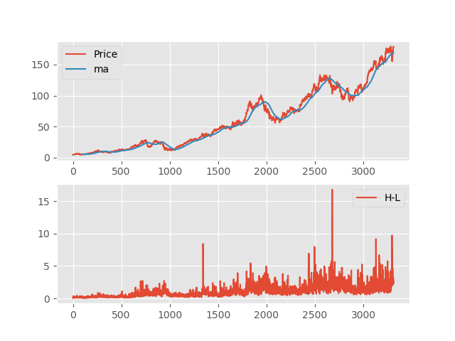
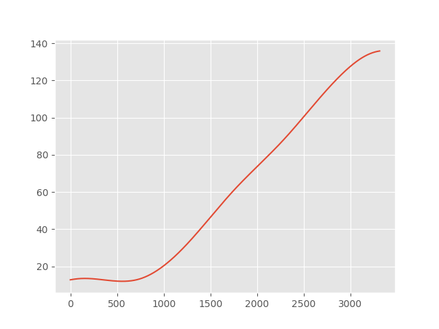

# pystocklib
Python package for Stock Market analysis. (Historical Data, EMD Trend signal, News extraction, News analysis, etc..)

# How to use

Get the historical data
```

hist = HistoricalData('AAPL', from_date=[2005, 1, 1], to_date=[2018, 3, 1])

price = hist.get_high()

# or use: hist.retrieve_col_data('Open') 'Date', 'Open', 'High', 'Low', 'Adj', 'Close', 'Volume'

```
#### Output
```

```


Plot & Generate CSV file
```

hist.create_csv()

plot(price)

```
#### Output
[CSV File](https://github.com/mohabmes/pystocklib/tree/master/pystocklib/AAPL.csv)<br>



Load data from csv file
```

hist = HistoricalData()

hist.load_csv('AAPL')

hist.info_plot('Close')

```
#### Output
```

```


Apply EMD & show the figure
```

emd = EMD(price)

emd.save_figure('AAPL-trend', type='trend') # type => trend, all, modes, ds

```
#### Output
```

```


Calc The SD
```

sdv = hist.standard_deviation('Open')

print(sdv)

```
#### Output
```
if 0 < sdv < 25
	then it will be considered as 'SAFE'
Otherwise
	it's 'RISKY'

```


Gather News & analysis it
```

news = News('Apple')

result = news.get_result()

```
#### Output
```
{
	'news': [
		{
		'text': 'Apple May Be Working on High-End Headphones and a Cheaper MacBook Air',
		'a': 'http://fortune.com/2018/03/10/apple-headphones-macbook-air/',
		'website': 'fortune.com',
		'sentiment': 0.6
		},
		{
		'text': "Apple's 14 Week December 2016 Quarter Seems To Have Confused A Lot Of People",
		'a': 'https://www.forbes.com/sites/chuckjones/2018/03/09/apples-14-week-december-2016-quarter-seems-to-have-confused-a-lot-of-people/',
		'website': 'forbes.com',
		'sentiment': -0.4
		}
		...
		...
		...
	],
	'sentiment': 0.019337121212121215
}

```

# Credit
- [AndrewRPorter](https://github.com/AndrewRPorter)
- [parkus](https://github.com/parkus)

# License
[MIT License](https://github.com/mohabmes/pystocklib/blob/master/LICENSE) Copyright (c) 2018 mohabmes
